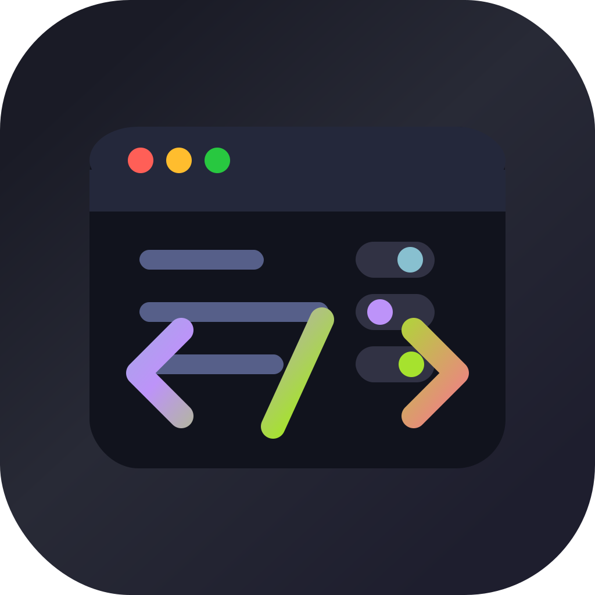

<p align="center">
  
</p>

# SketchyBar Studio

Native macOS companion app for editing SketchyBar configs without hand-editing every value.

SketchyBar Studio discovers your existing SketchyBar setup, presents editable values in a native GUI, and keeps file writes conservative so your config stays yours.

## Features

- Open a SketchyBar config folder, defaulting to `~/.config/sketchybar`.
- Support Lua config files plus old-school `sketchybarrc`, `.sketchybarrc`, and shell script files.
- Browse config files in path-first sidebar groups.
- Activate/deactivate items by commenting or uncommenting matching loader lines.
- Edit scalar values with purpose-built controls:
  - dropdowns for known SketchyBar choices
  - native color picker with opacity, saved as `0xAARRGGBB`
  - native macOS font panel, saved as SketchyBar font syntax
  - toggles for booleans
- Save `.studio-backup` copies before writing.
- Save profiles as full config folder snapshots.
- Search files and values.
- Show changed values only.
- Save all changes and apply with `sketchybar --reload`.
- Choose code-inspired app themes: Nord, Dracula, Monokai, Tokyo Night, Catppuccin.

## Screenshots


## Install

Until signed releases exist, build locally:

```bash
git clone https://github.com/YOUR-USER/sketchybar-studio.git
cd sketchybar-studio
./script/build_and_run.sh
```

For a distributable local `.app` bundle:

```bash
./script/build_and_run.sh --package
open dist/SketchyBarStudio.app
```

## Opening Unsigned Builds

Early GitHub release builds are unsigned and not notarized. macOS may block the app after download because the zip is quarantined.

Try right-clicking `SketchyBarStudio.app` and choosing **Open** first. If macOS still blocks it, remove the quarantine attribute manually:

```bash
xattr -dr com.apple.quarantine /Applications/SketchyBarStudio.app
```

If you run it from another folder, replace `/Applications/SketchyBarStudio.app` with the actual app path.

Only run this command for apps you downloaded from a source you trust.

## Known Limits

- The Lua editor intentionally edits simple scalar assignments first. Complex tables and computed values stay untouched.
- Shell support handles common `key=value` SketchyBar property assignments.
- Activation detection looks for references in `init.lua`, `sketchybarrc`, and `.sketchybarrc`; unusual loaders may need later pattern support.

## Run

```bash
./script/build_and_run.sh
```

Xcode can also open the Swift package directly.

## Contributing

See [CONTRIBUTING.md](CONTRIBUTING.md).

## License

MIT. See [LICENSE](LICENSE).
